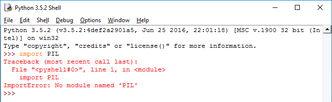

## What is pip?

If you have used Python before, you may have used code similar to this:

```python
from time import sleep
```

Or perhaps this:

```python
import random
```

In the examples above, you are importing a **module** in order to use code written by somebody else. The modules in the examples are called `time` and `random`, and are included by default when you install Python.

However, people have written lots of other Python modules, and you might want to use some of their functions in your Python programs. For example, if you want to manipulate images you might want to use `PIL`, or you could make games with `pygame`, or craft GUIs with `guizero`. However, if you try to use these modules without installing them, they won't work:



This is where **pip** comes in. To be able to use use external Python modules in your programs, you can use the pip tool to install them on your computer. (You have probably already seen instructions for installing Python modules with pip in guides on the Raspberry Pi website and on other websites.)

A Raspberry Pi with the standard version of Raspbian will have pip already installed.
